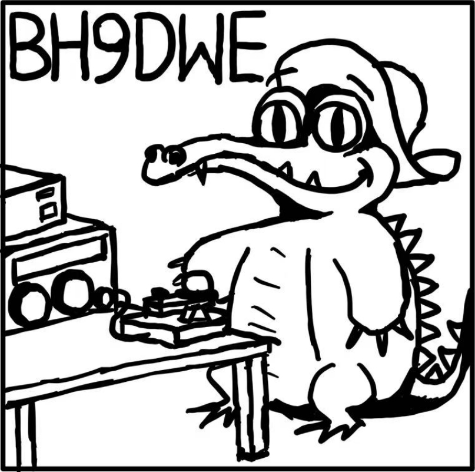

My name is Hou Xuzhao. Born in Shannxi province, China in 1999. PhD student in Department of Electrical Engineering, Tsinghua University, major in High-Voltage Engineering.

I am a radio amateur, got my callsign BH9DWE in 2018, a few months after I reached adulthood. I am one of the operators of amateur radio station ~~of~~ in Tsinghua University, [BY1QH](https://www.qrz.com/db/BY1QH).
